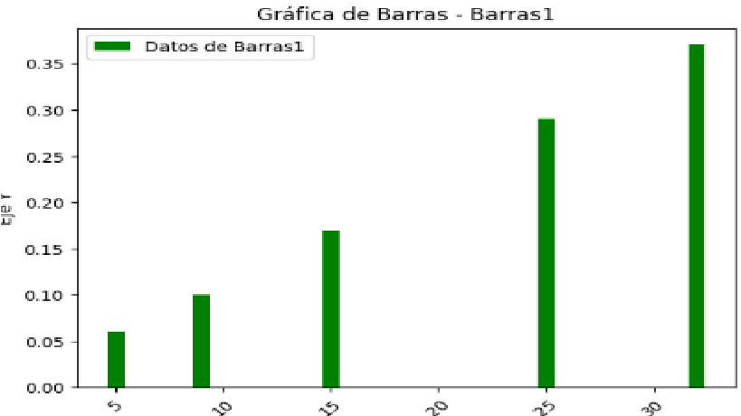
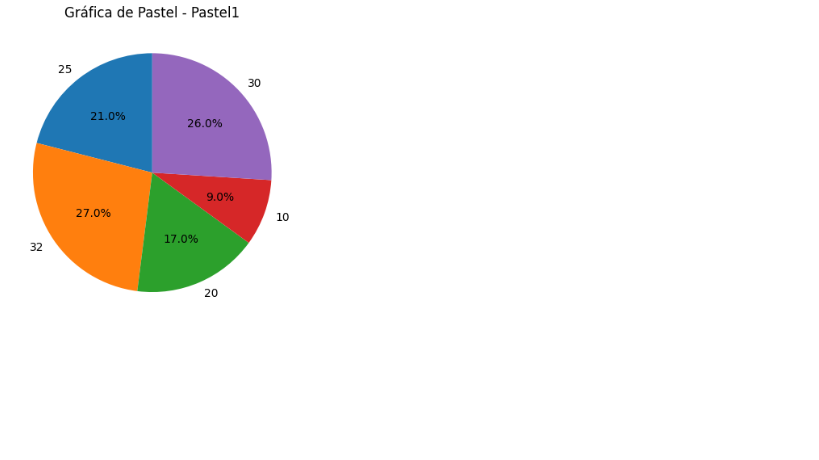

# Parcial3_otm106
<h1> Estudiante: David Enrique Pérez Bejarano Cursando Sistemas informaticos</h1>

<h2>  </h2>
el mismo codigo presenta partes de Python y entorno virtual añadido via cmd por problemas de la maquina aun asi presenta el codigo eficiente en la rama de generar imagenes tanto por nombre de hoja como por hoja indicada por bucle for mediante nombres dados a las variables.

Grafica en barras

 

Grafica en pastel

